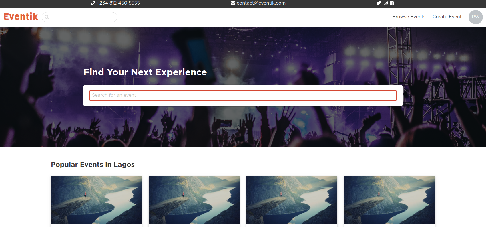

# Eventik

Explore, Create, and Attend Events! (Eventbrite Clone)

[Eventik](https://eventik-app.herokuapp.com/) is a full stack web application inspired by Eventbrite. It was built using Laravel on the backend, a PostgreSQL database, and Vue.js on the front end.

The application allows users to create events, browse events, and register for event tickets.

## Technologies Used

-   Laravel
-   PostgreSQL
-   Vue.js

## Installation

Please check the official laravel installation guide for server requirements before you start. [Official Documentation](https://laravel.com/docs/5.8/installation#installation)

Clone the repository

    git clone git@github.com:onxssiss/eventik.git

Switch to the repo folder

    cd eventik

Install all the dependencies using composer

    composer install

Copy the example env file and make the required configuration changes in the .env file

    cp .env.example .env

Generate a new application key

    php artisan key:generate

Run the database migrations (**Set the database connection in .env before migrating**)

    php artisan migrate

Start the local development server

    php artisan serve

You can now access the server at <http://localhost:8000>

## Database seeding

**Populate the database with seed data with relationships which includes users, articles, comments, tags, favorites and follows. This can help you to quickly start testing the api or couple a frontend and start using it with ready content.**

Open the DatabaseSeeder and set the property values as per your requirement

    database/seeds/DatabaseSeeder.php

Run the database seeder and you're done

    php artisan db:seed

**_Note_** : It's recommended to have a clean database before seeding. You can refresh your migrations at any point to clean the database by running the following command

    php artisan migrate:refresh
